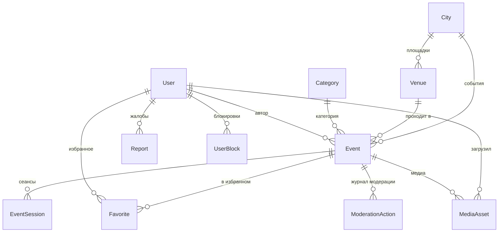

# Доменная модель

> Статус: черновик. Заполняется в ONW-7. Реализация — `apps/api/prisma/schema.prisma`.

## Три решения, зафиксированные явно

1. **Event отдельно от EventSession.** Концерт в трёх датах — одно событие и три
   сеанса, а не три события. Иначе лента засоряется дублями, а избранное и шаринг ломаются.
2. **Всё время в UTC + таймзона площадки.** «Сегодня» и «на этих выходных» считаются
   по времени города, а не устройства.
3. **`source` + `externalId` с уникальным индексом.** Импорта в Фазе 0 нет, но поля
   заложены сразу: добавить их задним числом к живым данным дороже, чем завести пустыми.

## ER-диаграмма

## Жизненный цикл события (ONW-31)

`draft → pending → published → rejected / hidden`. Лента показывает только `published`.
