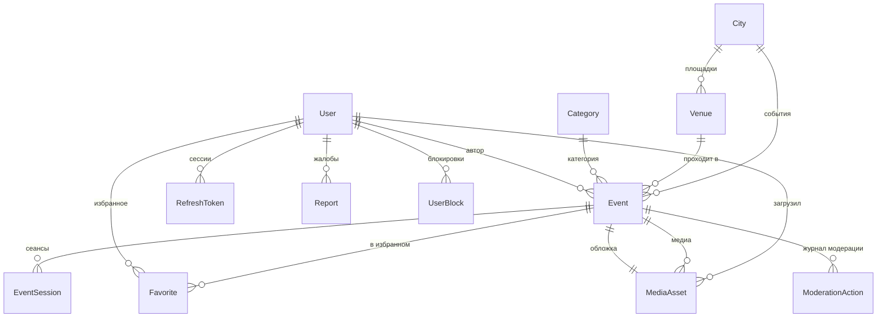

# Доменная модель

Реализация — [`apps/api/prisma/schema.prisma`](../apps/api/prisma/schema.prisma),
внешний контракт — [`packages/api-contract/openapi.yaml`](../packages/api-contract/openapi.yaml).
Этот документ объясняет, **почему** модель такая; схема отвечает на вопрос «какая».

Расхождение между документом и схемой — дефект документа: правим здесь, а не там.

## Три решения, зафиксированные явно

**1. Event отдельно от EventSession.** Концерт в трёх датах — одно событие и три
сеанса, а не три события. Если сплющить, лента засоряется дублями одного и того же
концерта, избранное начинает хранить «одну из дат», а шаринг ведёт непонятно куда.
Цена решения — денормализованное поле `Event.startsAt` с ближайшим сеансом, по
которому сортируется лента; его нужно пересчитывать при правке сеансов.

**2. Всё время в UTC (`timestamptz`) плюс таймзона города.** «Сегодня», «завтра» и
«на выходных» считаются по времени города, а не устройства. Человек в аэропорту
Стамбула, смотрящий афишу Тбилиси, должен видеть тбилисское «сегодня».

**3. `source` + `externalId` с уникальным индексом на `Event` и `Venue`.** В Фазе 0
импорта нет, оба поля пустые. Но добавить их задним числом к живым данным и
задним числом дедуплицировать — сильно дороже, чем завести пустыми сейчас.

## ER-диаграмма



## Сущности

### City

Сущность первого класса, а не строка в адресе: по городу скоупятся все запросы ленты.

| Поле | Зачем |
| --- | --- |
| `slug` | **Уникален.** Человекочитаемый ключ для ссылок и фильтров |
| `timezone` | IANA-зона. От неё зависят все пресеты дат — поле обязательное |
| `lat`, `lon` | Центр города: карта и определение ближайшего города по координатам |
| `isActive` | Город заведён, но ещё не открыт для пользователей |
| `popularity` | Порядок в списке выбора города |

Связи: площадки, события. Индекс `(isActive, popularity)` — под запрос списка городов.

### Category

| Поле | Зачем |
| --- | --- |
| `slug` | **Уникален.** Используется в фильтрах API |
| `nameKey` | Ключ локализации, не готовая строка: переводы живут в мобилке |
| `icon`, `sortOrder` | Отображение в фильтрах |

Набор фиксированный и засевается миграцией, а не сидом: категории — часть модели,
а не тестовые данные. Пользовательских категорий в Фазе 0 нет.

### Venue

Площадка из справочника. Событие может ссылаться на неё либо хранить свободный адрес.

| Поле | Зачем |
| --- | --- |
| `cityId` | Обязательна: площадка всегда принадлежит городу |
| `address`, `lat`, `lon` | Координаты приходят из геокодера (ONW-36) |
| `timezone` | Обычно совпадает с городом, но хранится отдельно |
| `placeId` | Идентификатор у провайдера геокодинга — по нему дедуплицируем |
| `source` + `externalId` | **Уникальны в паре.** Под будущий импорт |

### User

Один тип записи на гостя и на зарегистрированного — это позволяет апгрейдить
гостя, не теряя избранное.

| Поле | Зачем |
| --- | --- |
| `role` | `user` / `organizer` / `moderator` / `admin` (ONW-25) |
| `isGuest` | Аккаунта нет, но сессия есть (ONW-21) |
| `deviceId` | **Уникален.** По нему находится гостевая учётка при перезапуске |
| `email` | **Уникален, опционален.** Apple может его не отдать вовсе |
| `googleSub`, `appleSub` | **Уникальны.** Опора аккаунта — `sub`, а не email: email у провайдера может смениться |
| `acceptedTermsVersion`, `acceptedTermsAt` | Версия принятого EULA (ONW-61). Нужно уметь доказать, когда и на что человек согласился |
| `deletedAt` | Мягкое удаление: события удалённого автора не должны обрушить ленту |

### RefreshToken

Отдельная сущность, потому что ротация требует истории, а не одного текущего значения.

| Поле | Зачем |
| --- | --- |
| `tokenHash` | **Уникален.** Хранится хэш, не сам токен |
| `familyId` | Цепочка ротации. Переиспользование старого токена из цепочки трактуется как кража и отзывает всю цепочку целиком (ONW-22) |
| `deviceId` | Привязка к устройству: «выйти на этом телефоне» |
| `expiresAt`, `revokedAt` | Истечение и явный отзыв различаются |

### Event

| Поле | Зачем |
| --- | --- |
| `status` | `draft` → `pending` → `published` → `rejected` / `hidden` |
| `authorId` | UGC: у каждого события есть автор, и он несёт за него ответственность |
| `startsAt` | **Денормализация:** время ближайшего **будущего** сеанса; если будущих нет — последнего прошедшего. Лента сортируется и фильтруется по нему, иначе каждый запрос тянул бы агрегат по сеансам и индекс `(cityId, status, startsAt)` был бы бесполезен. Инвариант поддерживается при правке сеансов и фоновой задачей, когда сеанс проходит |
| `venueId` либо `rawAddress` | Площадка из справочника или свободный адрес |
| `geoUnresolved` | Геокодер не распознал адрес. Событие всё равно создаётся, но помечается для модератора — терять UGC из-за кривого адреса нельзя |
| `ticketUrl` | Только внешняя ссылка. Оплаты внутри приложения нет |
| `coverId` | Обложка. Без неё событие в ленте выглядит мёртвым |
| `rejectionReason` | Причина отказа, видна автору на экране «Мои события» |
| `deletedAt` | Мягкое удаление: скрытый по жалобе контент нужен для разбора |
| `source` + `externalId` | **Уникальны в паре** |

### EventSession

| Поле | Зачем |
| --- | --- |
| `startsAt` | UTC. Обязательно |
| `endsAt` | Опционально: у многих событий конец не объявлен |

Каскадное удаление вместе с событием. Индекс `(eventId, startsAt)` — карточка,
`(startsAt)` — выборка будущих сеансов.

### MediaAsset

| Поле | Зачем |
| --- | --- |
| `storageKey` | **Уникален.** Ключ объекта в бакете |
| `isConfirmed` | Клиент грузит файл напрямую в S3 по presigned URL, минуя API. Пока не подтверждено и не проверено сервером — ассет ничей (ONW-34) |
| `variants` | Три размера от воркера ресайза (ONW-35). Пусто — клиент показывает плейсхолдер, а не битую картинку |
| `mimeType`, `sizeBytes` | Проверяются по содержимому, а не по расширению |

Индекс `(isConfirmed, createdAt)` — под уборку неподтверждённых ассетов по расписанию.

### Favorite

Составной первичный ключ `(userId, eventId)` — он же защита от дублей, поэтому
операции добавления и удаления идемпотентны без дополнительных проверок.
Индекс `(userId, createdAt)` — под курсорную пагинацию списка избранного.

### Report и UserBlock

Требование App Store Guideline 1.2. Без них UGC-приложение отклоняют — это
блокер релиза, а не улучшение.

`Report` уникален по `(authorId, targetType, targetId)`: повторная жалоба того же
человека на тот же объект не создаёт дубль и не накручивает счётчик. Индекс
`(status, createdAt)` — очередь модерации сортируется по возрасту, SLA реакции 24 часа.

`UserBlock` — составной ключ `(blockerId, blockedId)`, блокировка односторонняя и
мгновенная, решения модератора не требует.

### ModerationAction

Журнал: кто, когда, из какого статуса в какой и почему. Нужен для внутренних
разборов и для ответа проверяющему Apple, если он спросит, как обрабатываются жалобы.

## Жизненный цикл события

```
draft ──submit──► pending ──approve──► published ──┐
  ▲                  │                             │
  │                  └──reject──► rejected         ├──hide──► hidden
  └──────────────── правка ◄──────────┘            │
                                                   └──► (правка) ──► pending
```

Лента показывает только `published`. Переходы централизованы в одном сервисе —
произвольная смена статуса из контроллеров невозможна (ONW-31). У роли `organizer`
переход `draft → published` происходит минуя очередь.

## Индексы, которые стоят здесь не случайно

| Индекс | Под какой запрос |
| --- | --- |
| `Event(cityId, status, startsAt)` | Основной запрос ленты (ONW-28) |
| `Event(startsAt, id)` | Курсорная пагинация: курсор кодирует именно эту пару |
| `Event(authorId, status)` | Экран «Мои события» (ONW-58) |
| `City(isActive, popularity)` | Список городов на онбординге |
| `Report(status, createdAt)` | Очередь модерации по возрасту |

## Намеренно отложено

- **PostGIS-поиск по радиусу.** Расширение подключено и координаты хранятся, но
  запросов «рядом со мной» в Фазе 0 нет: город выбирается явно.
- **Полнотекстовый поиск.** Начинаем со встроенного FTS Postgres; Meilisearch
  появится, когда упрёмся в него, а не заранее.
- **Импорт из внешних источников.** Поля заложены, парсеров нет.
- **Push-уведомления.** Сертификаты готовятся в ONW-15, модель — позже.
